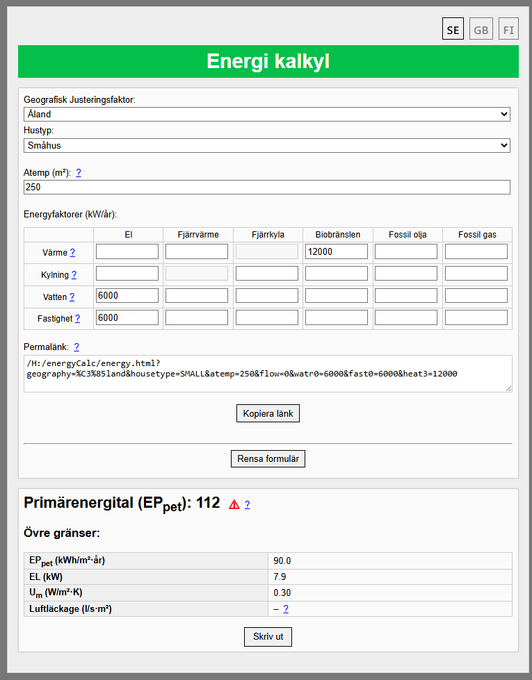

# Energy Calculator

Calculates EPpet, in accordance with   Landskapsförordning (2015:5) om Ålands byggbestämmelsesamling

---

## Usage

just serve the files in your preferred way, all the logic happens client side

---

## Features

- **Calculates EPpet**  
- **Shows relevant limits**  
- **Prints a fancy energy certificate**

---

## issues

Flerbostadshus, lokal, fotnoter bör dubbelkollas.
ep limit för class A-G bör dubbelkollas

css could use some work

## Help-icon logic

For any key `x`, a “?” help icon will be shown **if and only if** all of the following are true:

1. There is an element in the DOM with `id="x_help_icon"`.  
2. There is a matching help container with `id="x_help"`.  
3. `STRINGS` in  `strings.js` has a non blank entry with `x_help`

---

## Development and Testing

Run the automated tests by opening `tests.html` in a browser.

---
## File Structure

| Filename           | Description                                                    |
|--------------------|----------------------------------------------------------------|
| `energy.html`      | Main webpage for user interaction                               |
| `energyprint.html` | A page to print out energy certificate thingie      |
| `energy.js`        | Core calculation logic, (transpiled from ´dev/energy.c´ using gippy) |
| `glue.js`          | Controls the DOM and ui. |
| `strings.js`       | User facing strings and translations           |
| `style.css`        |     css                                                             |
| `dev/`      | marginally useful files for developement|
| `tests.html`      |  test file(not very good) |

---

## Screenshots

### Main Interface

### Printed Certificate PDF

